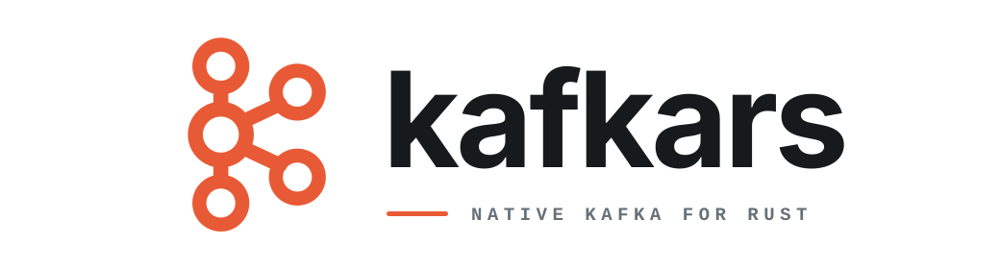

<p align="center">
  
</p>

# kafkars

`kafkars` is a deterministic, runtime-neutral Rust client for Apache Kafka®.
It treats deadlines, retained bytes, operation completion, cancellation, and
delivery certainty as explicit ownership rather than incidental runtime
behavior.

## Status

Version `0.0.1` is a source preview for API evaluation. It is not a beta,
production release, or general broker-compatibility claim.

The source includes concrete producer, direct and group consumer, admin,
transaction, metrics, security, and shutdown APIs. There is no stable API
promise or maintained real-broker matrix yet. This preview is Rust-only; a
future foreign interface will require its own versioned contract and
qualification. See [support and compatibility](SUPPORT.md) for the exact
boundary.

## Use

```toml
[dependencies]
kafkars = "0.0.1"
```

```rust
use kafkars::{Client, KafkaError};

fn client() -> Result<Client, KafkaError> {
    Client::builder()
        .bootstrap_servers(["localhost:9092"])
        .client_id("orders-api")
        .build()
}
```

Compile-checked examples cover the
[producer](crates/kafkars/examples/producer.rs),
[consumer](crates/kafkars/examples/consumer.rs),
[admin](crates/kafkars/examples/admin.rs), and
[transaction](crates/kafkars/examples/transaction.rs) surfaces.

## Design

```text
kafka-client-core ----------------------+
    deterministic policy                |
                                         v
kafka-wire -----------> kafka-driver -> kafka-client-engine ---> kafkars
    protocol bytes        RPC and I/O      integration owner      Rust facade
```

The core owns semantic time, retained-byte accounting, cancellation, and
terminal decisions without owning networking or an async runtime. The engine
owns one embedded driver reactor, bounded execution, protocol adaptation,
shutdown, and recovery. `kafkars` exposes the curated public Rust API.

`kafka-client-sim` supplies virtual-time execution, and
`kafka-client-guardrails` enforces repository and architecture policy. Most
applications should depend only on `kafkars`.

## Validate

Rust `1.88.0`, Git, and Bash are required. From a clean clone:

```sh
./scripts/bootstrap-siblings
./scripts/check
```

The bootstrap script checks out the exact reviewed `kafka-driver` and
`kafka-wire` revisions. The gate fails closed if either sibling differs from
that provenance.

## Known limitations

- No Kafka version or security combination is release-supported yet.
- Exact-broker aggregation and fetch behavior fail closed when the reviewed
  driver cannot provide broker identity or an exact-broker route.
- KIP-848 paths that require Kafka topic IDs fail closed; count-only behavior
  that does not require those IDs remains available.
- `ClientBuilder::client_id` retains validated configuration, but the pinned
  driver does not yet put it into Kafka request headers.

## License

Apache-2.0.

Read [ARCHITECTURE.md](ARCHITECTURE.md) before changing ownership boundaries.
See [CONTRIBUTING.md](CONTRIBUTING.md) for participation and
[SECURITY.md](SECURITY.md) for private vulnerability reporting.

## Trademarks

KAFKA is a registered trademark of The Apache Software Foundation and has been
licensed for use by kafkars. kafkars has no affiliation with and is not
endorsed by The Apache Software Foundation. See the
[Apache Kafka trademark policy](https://kafka.apache.org/community/trademark/).
